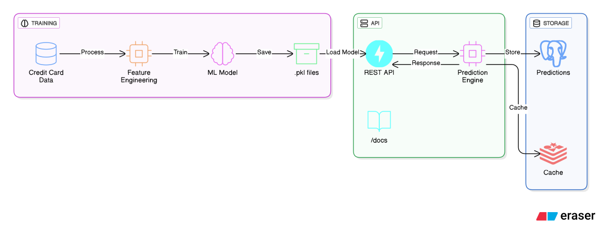

# OOF

A production-ready fraud detection system using Machine Learning (Isolation Forest) deployed as a scalable REST API with PostgreSQL and Redis caching.

## About

This project detects fraudulent credit card transactions using an Isolation Forest machine learning model deployed as a REST API. Built to handle highly imbalanced data (only 0.172% fraud cases), the system achieves 95.3% ROC-AUC and 81.63% recall. The FastAPI backend provides real-time predictions with PostgreSQL for persistence and Redis for caching and rate limiting.

## About the Dataset

The dataset I used is the [Credit Card Fraud Detection Dataset](https://www.kaggle.com/datasets/kartik2112/fraud-detection). What makes this dataset challenging and realistic is that it's highly imbalanced - only 492 transactions out of 284,807 are fraudulent, which is just 0.172% of the total.

## Model Training Results

The Isolation Forest model achieved:

| Metric | Score |
|--------|-------|
| **ROC-AUC** | 95.3% |
| **Recall** | 81.63% |
| **Precision** | 6.61% |
| **F1-Score** | 0.122 |
| **Training Time** | ~8 seconds |
| **Inference Time** | <50ms |

## Problems I Faced

### 1. Choosing the Right Algorithm
Because the dataset had a lot of class imbalance, I chose Isolation Forest because it works very good in isolating outliers. 

### 2. Threshold Optimization
Setting the threshold too low meant too many false alarms, too high meant missing real fraud. I created a script to test different thresholds and visualize the trade-off between recall and precision. Eventually found a sweet spot where we catch 81% of frauds while keeping the system practical.

### 3. Feature Scaling
The 'Time' and 'Amount' features had very different scales compared to the V1-V28 features. Initially, the model was giving too much weight to these unscaled features. I solved this by applying StandardScaler to normalize them before training, which improved model performance significantly.

## Built With

- **Python 3.13**
- **FastAPI** - 
- **scikit-learn** 
- **PostgreSQL** 
- **Redis** 
- **Docker** 
- **SQLAlchemy** 
- **Alembic** 
- **pytest**

## Architecture

### Prerequisites

- Python 3.13.9
- Docker and Docker Compose
- PostgreSQL 13 (if running without Docker)
- Redis 6 (if running without Docker)
